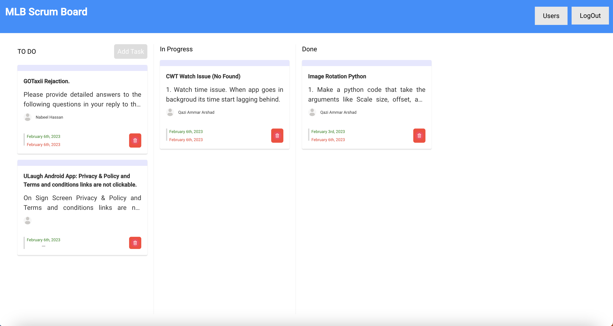
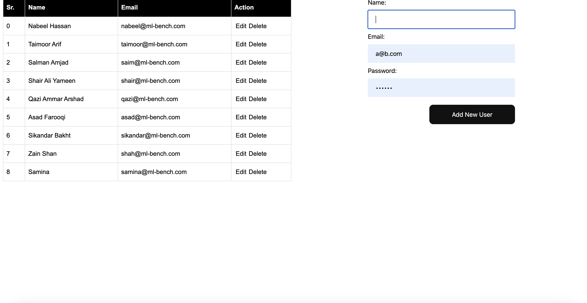
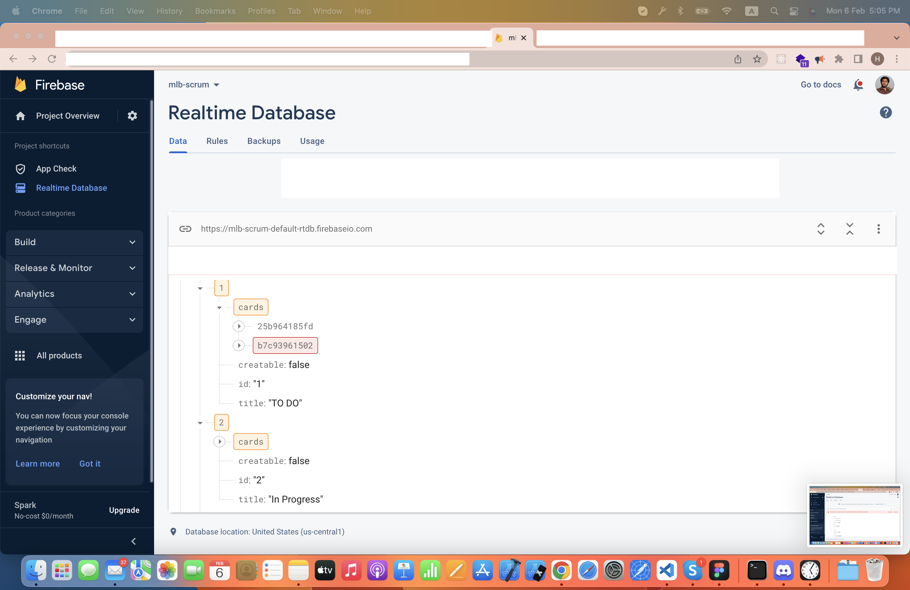

# RealTime Scrum Board


ReactJS, MLB Scrum Board with realtime database (firebase).

MLB Scrum Board is an open-source, ReactJS base task management tool designed for startups and individual developers. Utilizing ReactJS and a real-time database with Firebase, it provides an efficient and zero cost alternative to Jira with a focus on functionality over aesthetics. Future versions will prioritize improving the user interface.

This project is open to contributions and all are welcome to contribute to the development of the ReactJS Scrum Board. Whether it's fixing bugs, adding new features, or improving the user experience, your contribution is valued and appreciated. So join us in making the ReactJS Scrum Board a better tool for everyone.

This project is inspired by the [ReactJS Scrum Board](https://github.com/Gerlison/rjs_scrum_board) repository on GitHub and has utilized its base code as a starting point.


## Installation


To install the project's dependencies.

```bash
  npm install
```

or if you prefer `yarn` instead `npm`

```bash
  yarn
```

## 2. Create a new firebase project
Login to your google account and create a new firebase project [here](https://console.firebase.google.com/u/0/)

Create an `.env` file and add the following variables.

```
// SAMPLE CONFIG .env, you should put the actual config details found on your project settings

REACT_APP_FIREBASE_API_KEY="AIzaKJgkjhSdfSgkjhdkKJdkjowf"
REACT_APP_FIREBASE_AUTH_DOMAIN="yourauthdomin.firebaseapp.com"
REACT_APP_FIREBASE_PROJECT_ID="yourproject-id"
REACT_APP_FIREBASE_STORAGE_BUCKET="yourstoragebucket.appspot.com"
REACT_APP_FIREBASE_MSG_SENDER_ID="43597918523958"
REACT_APP_FIREBASE_APP_ID="234598789798798fg3-034"
``` 

## 3.Setting up Firebase
1. Go to the **Firebase Console** and create a new project.
2. Go to the **Database** section and create a new **Realtime Database.**
3. Go to the Rules tab and set the read and write rules to true.
4. Click the "Publish" button to save your changes.
5. In the Project Overview section, click on the **"Add Firebase to your web app" button.**
6. Copy the configuration code, paste the Firebase configuration code that you copied earlier into your .env file.


## Running

```bash
  # for development
  yarn run start

  # for production
  yarn run build
```

## Features

- Create Real-Time Tickets: Quickly and easily create tickets for tasks and bugs within the system in real-time.
- Add Users: Add and manage users within the system, giving the ability to assign tasks to multiple users.
- Assign Tasks: Assign tasks to multiple users and manage the progress of each task individually.
- Detailed Tasks: Add details and deadlines for each task, allowing for better organization and management.
- Login Feature (Under Development): A login feature is currently under development, providing an added level of security for your data.

## Screenshots

|                                                                                                      |
| :--------------------------------------------------------------------------------------------------: |
|  |
|  |
|  |

## Contributing

### Create a fork

To contribute to a open source project, you can do a fork from the source code, do your own changes on a copy without compromising the original.


### Open a Pull Request

With all your changes done, and you are ready to contribute, open a pull request to the _upstream_ `develop` branch. Your PR will be analysed, discuted and aproved gratefuly.

> About [pull requests](https://help.github.com/pt/github/collaborating-with-issues-and-pull-requests/about-pull-requests)
